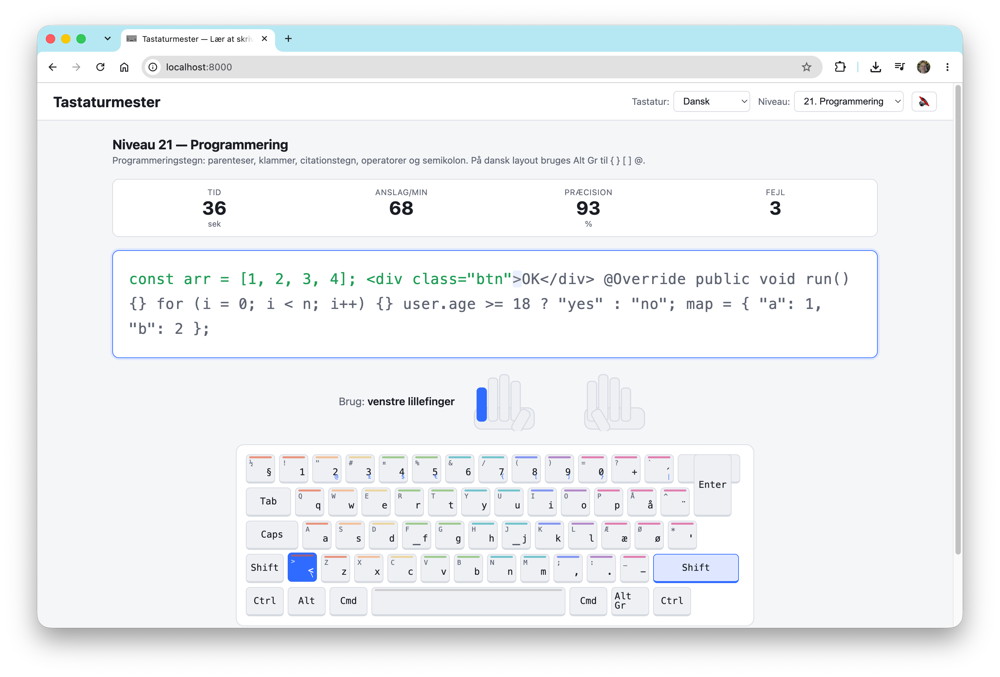

# Tastaturmester

Tastaturmester er et gratis website på dansk til at øve 10-finger tastatur system, bygget i ren HTML, CSS og JavaScript.

Findes online på https://tastaturmester.dk/, koden til siden kan du finde i dette repository.

En særlig funktionalitet i denne tastatur-træner, er muligheden for at træne typiske tegn der benyttes teil programmering:


## Kør lokalt

Siden er bygget med statisk HTML, så det er muligt at køre siden lokalt, f.eks. ved udvikling.

### Option 1: Python HTTP server (anbefalet)

Fra denne mappe:

```bash
python3 -m http.server 8000
```

Åbn derefter http://localhost:8000 i din browser.

### Option 2: Åbn direkte i din browser

Du kan også åbne filen `index.html` direkte fra denne mappe i en browser, men det anbefales at bruge en lokal web server for at undgå f.eks. problemer med lokal fil-adgang fra browser.
